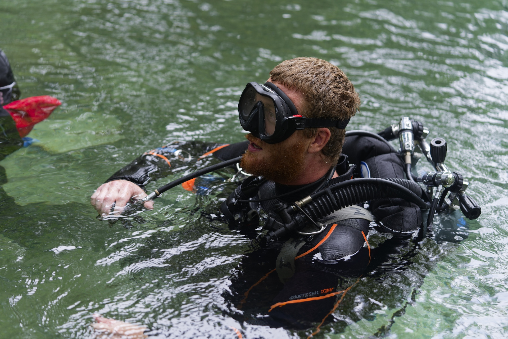
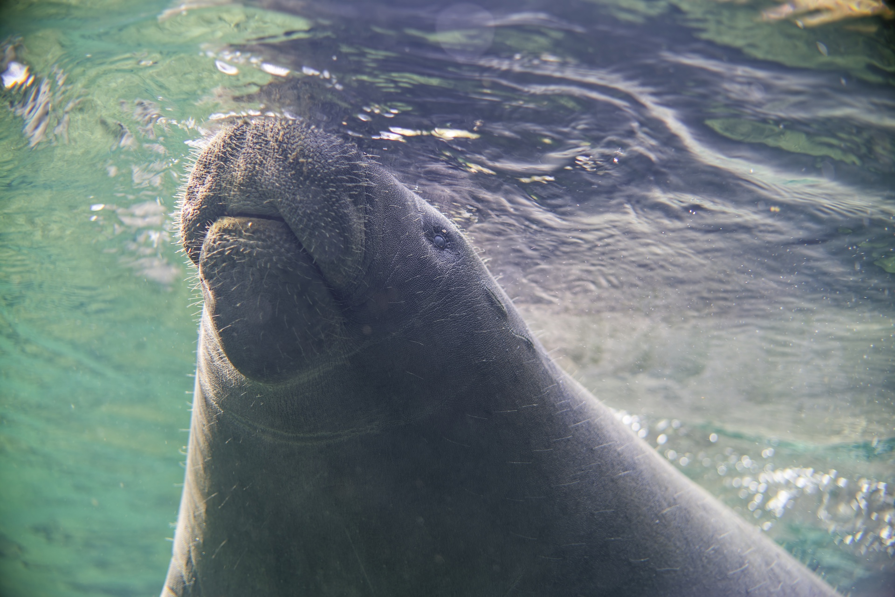
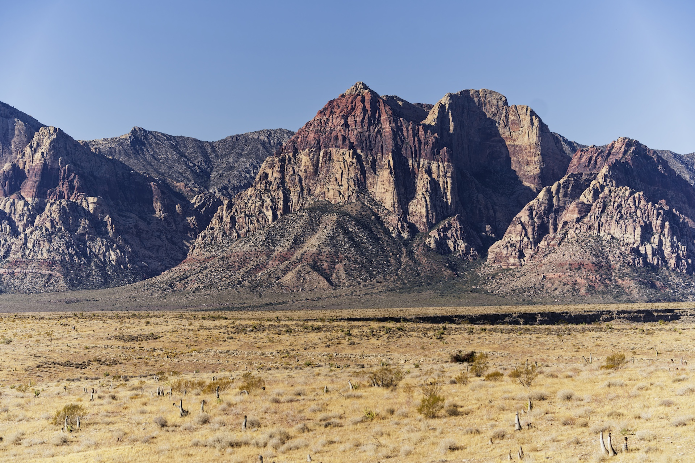
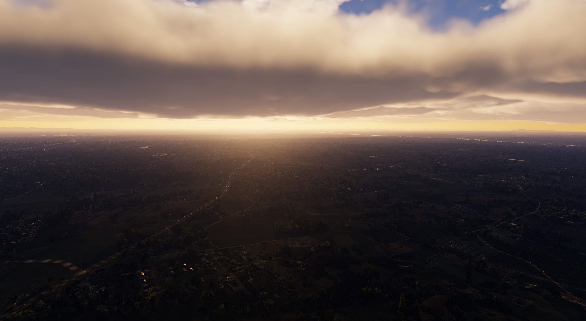
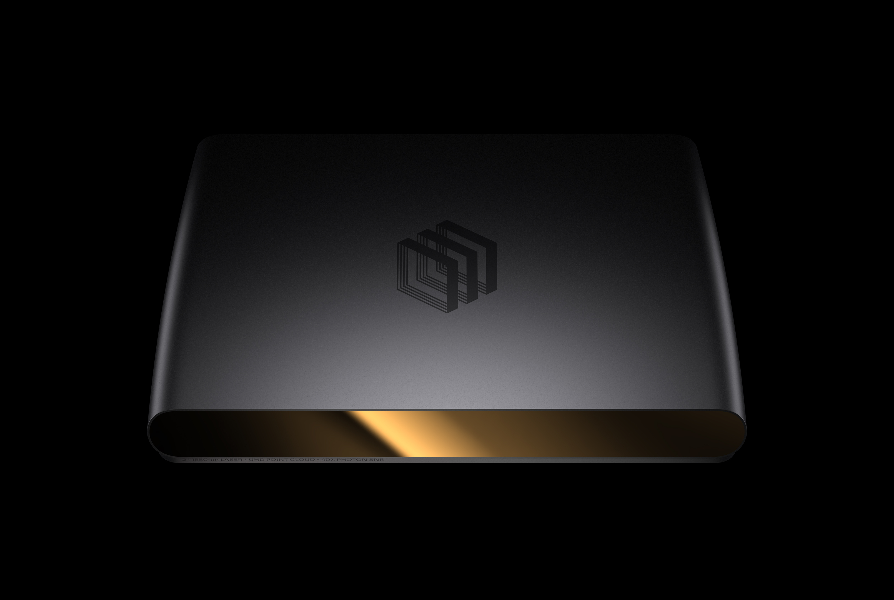

+++
title = "About"
path = "about"
+++

I'm an avid cave diver, exploring Florida's underwater caves to preserve and document their beauty.
I work with Karst Underwater Research to survey and document the caves,
providing data to the state for conservation and preservation efforts.

I love to travel and explore new places, taking photos as I go.

A friendly manatee at Blue Springs State Park in Florida.

Red Rocks National Park near Las Vegas.

Climbing in Red Rocks National Park.

## Professional

I've enjoyed engineering since I was a kid.
I've always been fascinated by how things work and how to make them better.
I've been fortunate to have the opportunity to work on a wide variety of projects in my career.

I started my career at one of the world's largest aerospace companies,
where I was lucky enough to work on one of the first DirectX 11 rendering engines ever released.
I had the opportunity to work on a tiny, dedicated team to build a brand new rendering engine for Microsoft Flight Simulator.
I'm proud to say that there is still nothing quite like it in the industry.

Since then, I founded and built one of the world's first high-tech escape rooms,
and have spent over a decade running my own consulting company.
I've built mobile apps for the largest accounting software company in the US,
open source intelligent tutoring systems for the US government,
and embedded firmware, mobile apps, and backends for some of the largest companies in the world.

I've spent the last six years at Luminar Technologies,
where I've had the opportunity to work on some of coolest optical systems and signal processing problems imaginable.
